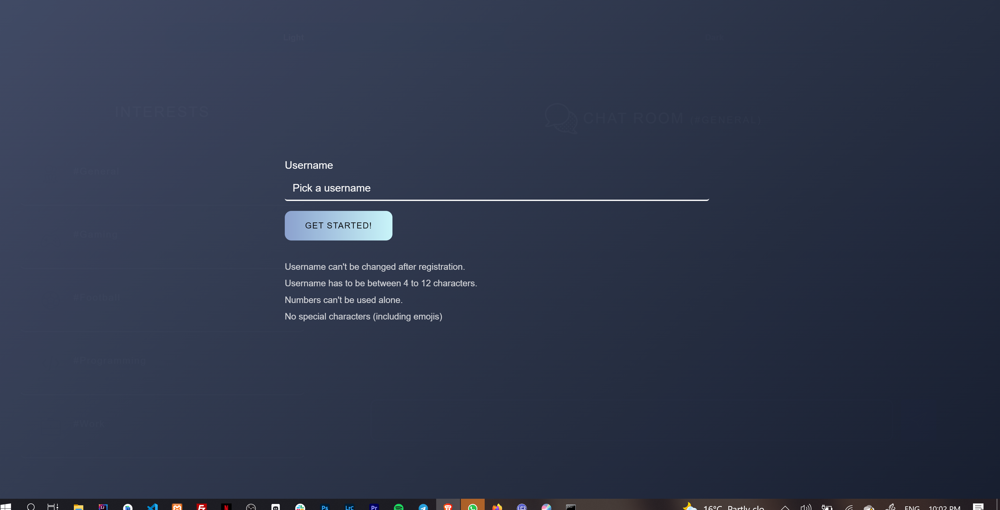
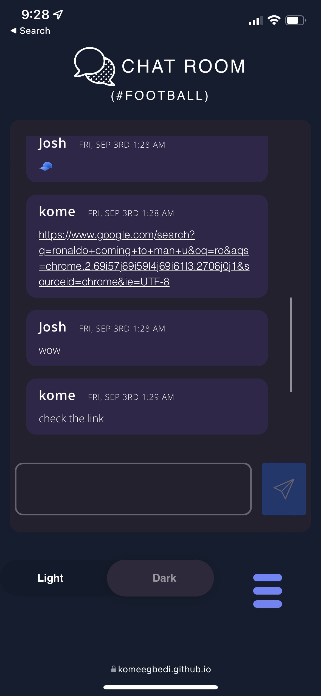
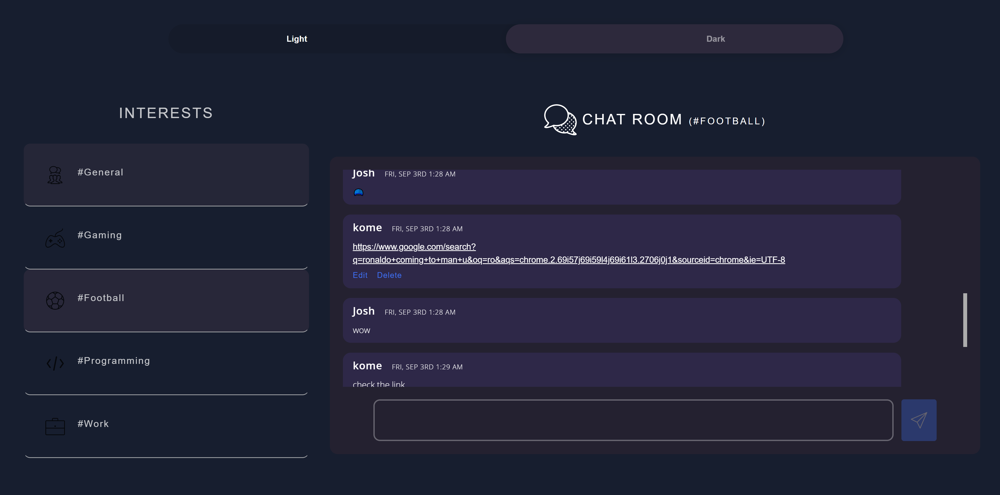
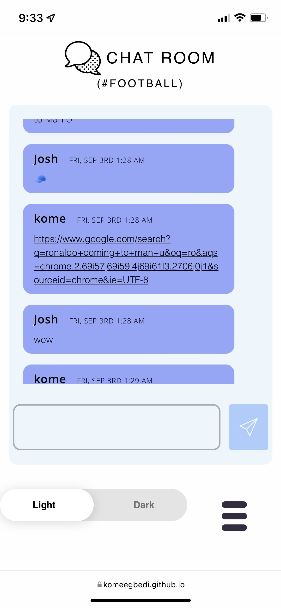

# Description

   A chatroom website that enables user communicate based on their interests( #general, #football, #gaming, #programming and #work). 
   
   Users are able to modify their messages (edit and delete), users can see when  other users are typing , users are also able to send links (no images and videos). 

   Users are also able to choose between light and dark mode. By default it works with the default setting of their OS and if the users OS does not support dark and light mode, it is scheduled to be in dark mode at night time.

   You can view the Chat room live here : https://komeegbedi.github.io/Chatroom/
   
   
## Architecture 

 

  - Presentation
      - Index.html (in Presenation folder)
      - style.css
   - Business
      - App.js
         - This handles mofificataion the design(look or feel) of the webpage (i.e dark or light mode, open or close navabar )
      - ChatUI.js
         - This  handles the logic of how the entire chat works (sending, deleting, modifying chats, detecting links, see when a using is typing)
   - Persistences
      - Chat.js
         - This chat class represents a user and all the messages they send. This class is also used to communicate with the database (firebase).
      - Login.js
         - This program handles logging the user in 

## Technologies used

 - HTML
 - CSS
 - JavaScript
 - Bootstrap
 - Animate.css
 - Firebase

 ##  How to use 
 
 **Visual Explanation here:** https://twitter.com/komeegbedi/status/1434325972925521922?s=20
 

 1. When you visit the website for the first time, you would be promoted with a screen to choose a username. You are to choose a username following the guidelines listed.
 
 
  2. After you choose a valid username, you would be directed to the "#general" room and you can start sending messages. 
  
      To select a different room (You can use the images below for reference), 
      On the mobile version click on the 3 bar at the bottom right corner of the screen 
      On the desktop version, you should see the rooms listed at the left side on the page

   ## Images of the chatroom

   **Dark Mode**

     

   **Light mode**

     

