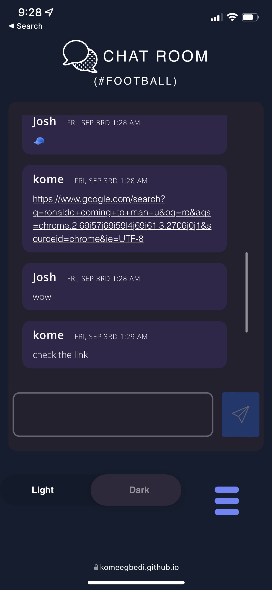
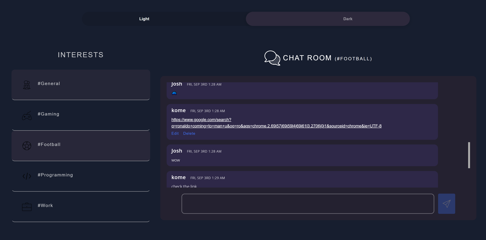
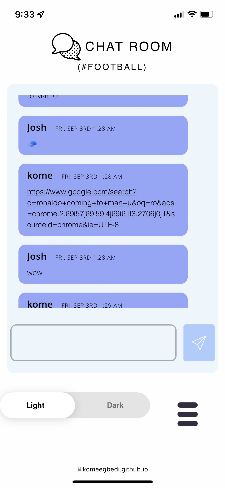
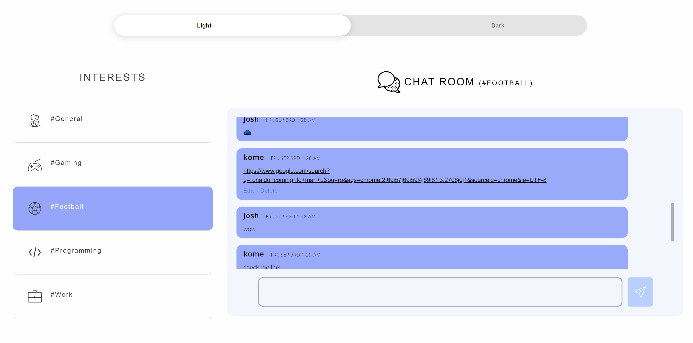

# Description

   A chatroom website that enables user communicate based on their interests( #general, #football, #gaming, #programming and #work). 
   
   Users are able to modify their messages (edit and delete), users can see when  other users are typing , users are also able to send links (no images and videos). 

Users are also able to choose between light and dark mode. By default it works with the default setting of their OS and if the users OS does not support dark and light mode, it is scheduled to be in dark mode at night time.

## Images of the chatroom

**Dark Mode**
    
 
**Light mode**
     

## Technologies used

 - HTML
 - CSS
 - JavaScript
 - Bootstrap
 - Firebase
