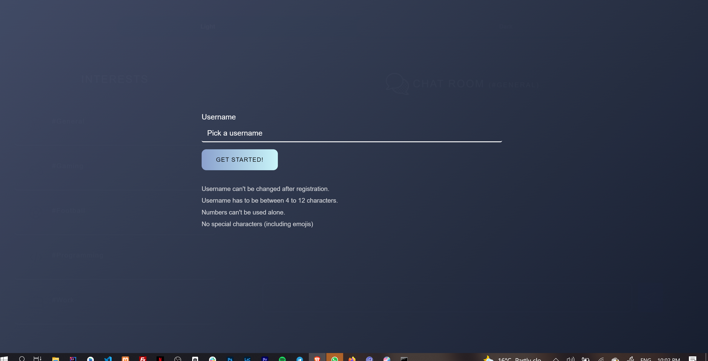

# Description

   A chatroom website that enables user communicate based on their interests( #general, #football, #gaming, #programming and #work). 
   
   Users are able to modify their messages (edit and delete), users can see when  other users are typing , users are also able to send links (no images and videos). 

Users are also able to choose between light and dark mode. By default it works with the default setting of their OS and if the users OS does not support dark and light mode, it is scheduled to be in dark mode at night time.

## Images of the chatroom

**Dark Mode**

   
 
**Light mode**

   
 
 ##  How to use 
 
 **Visual Explanation here:** https://twitter.com/komeegbedi/status/1434325972925521922?s=20
 

 1. When you visit the website for the first time, you would be promoted with a screen to choose a username. You are to choose a username following the guidelines listed.
 
 
  2. After you choose a valid username, you would be directed to the "#general" room and you can start sending messages. 
      To select a different room , 
      On the mobile version click on the 3 bar at the bottom right corner of the screen 
      On the desktop version, you should see the rooms listed at the left side on the page

## Technologies used

 - HTML
 - CSS
 - JavaScript
 - Bootstrap
 - Firebase
